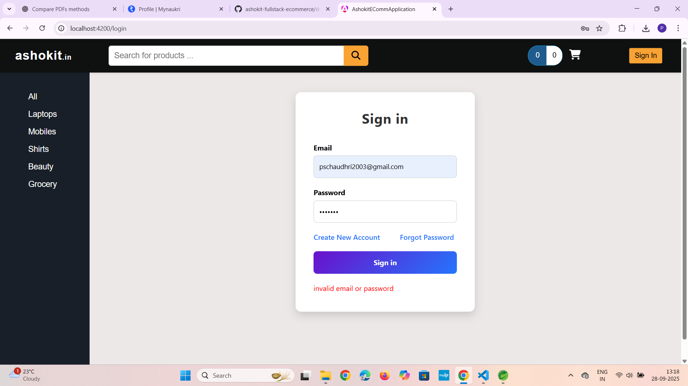
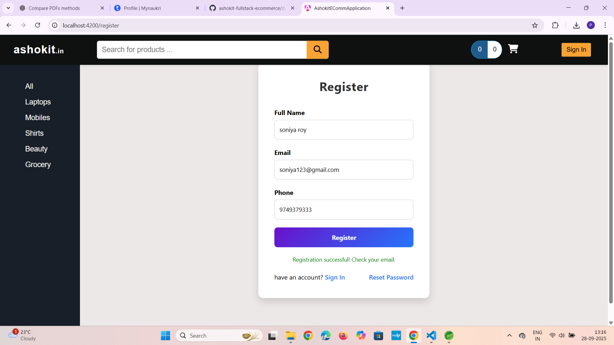
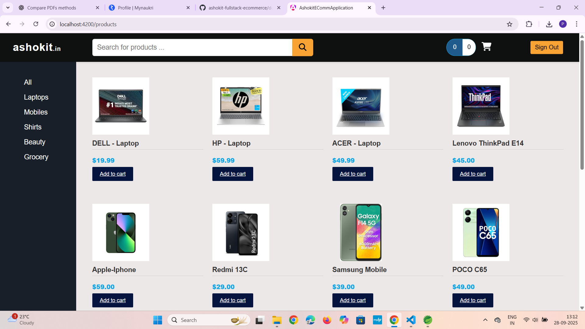
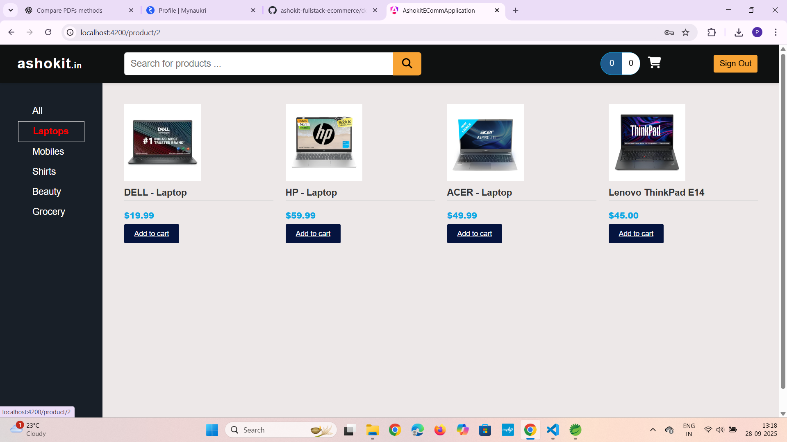
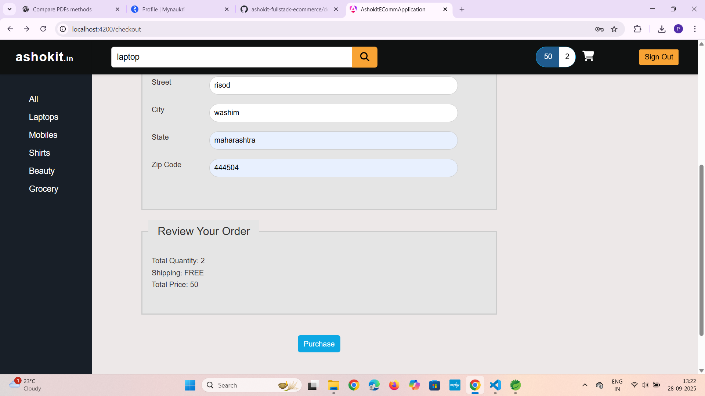
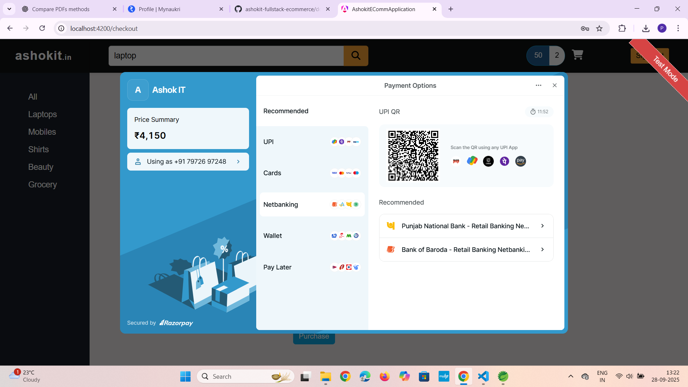
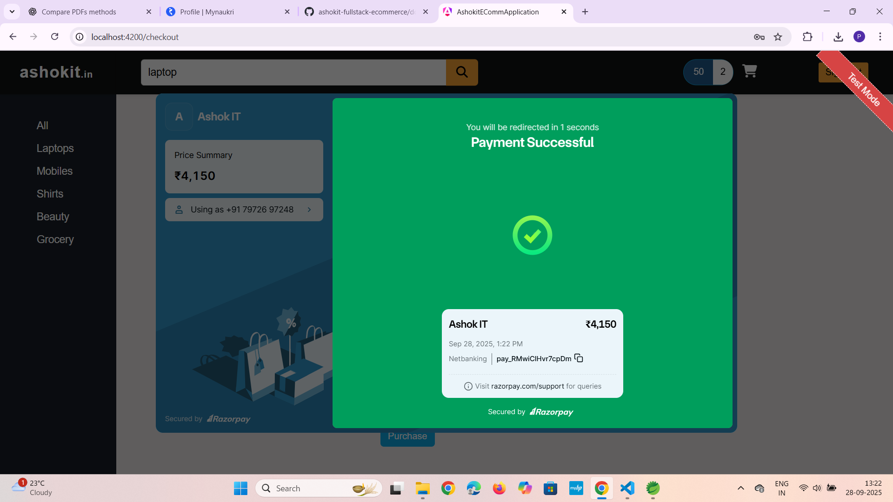
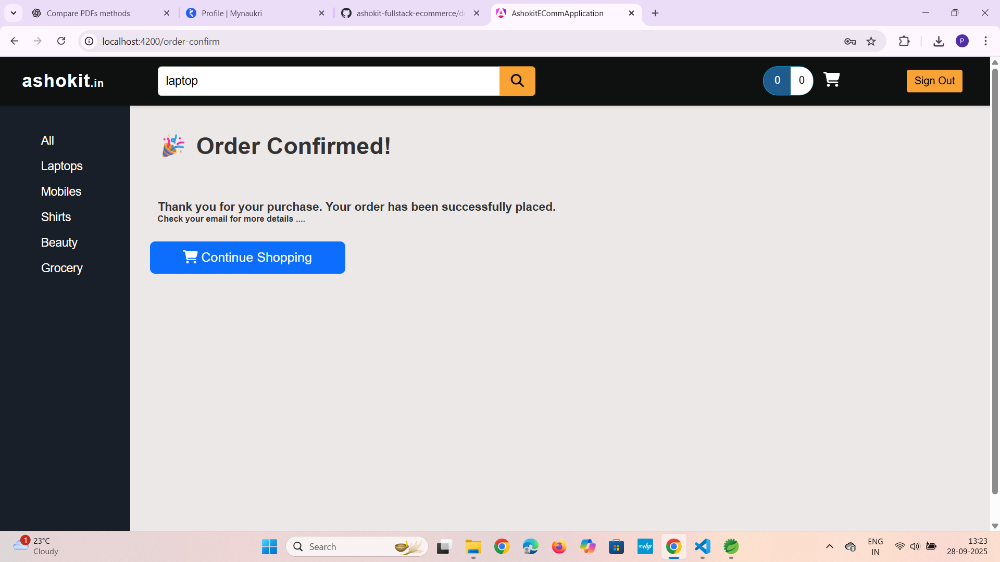
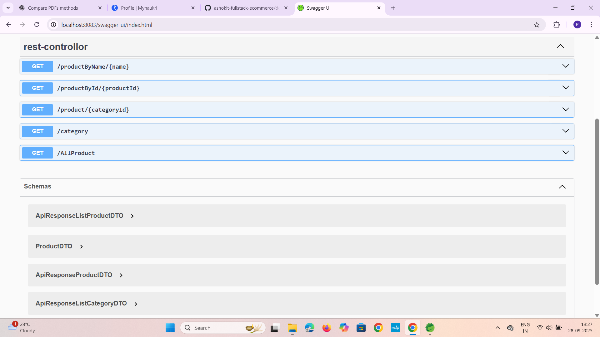

# 🛒 Full Stack E-Commerce Application

Full Stack E-Commerce web application with Java Spring Boot microservices backend and Angular frontend, deployed using Docker.

This is a **Full Stack E-Commerce Application** built with:

* **Backend**: Java, Spring Boot, Microservices, REST APIs, JPA
* **Frontend**: Angular
* **Database**: MySQL (with preloaded schema & data)
* **Containerization**: Docker & Docker Compose

---

## ⚙️ Prerequisites

* **AWS EC2 instance** (Ubuntu recommended) for cloud deployment
* **Docker** & **Docker Compose** installed
* **Node.js** & **Angular CLI** installed (for frontend)
* **Git** installed
* Local machine with **ports 8081, 8082, 8083, 3306** free
* MySQL Workbench or MySQL service (optional if using Dockerized MySQL)

---

## ✨ Features

* 👤 **User Authentication**: Login & Registration
* 🛍 **Product Catalog**: Browse products with categories
* 🔎 **Search**: Quickly find products by name
* 🗂 **Filter by Category**: View products based on selected categories
* 🛒 **Order Booking**: Add products to cart and place an order
* 📦 **Order Management**: Manage placed orders

---

## 🎬 Demo Video

[Demo Video](https://github.com/pooja-chaudhri/ashokit-fullstack-ecommerce/blob/main/ashokit-e-comm-application/public/Demo%20Link.mp4)

---

## 💻 EC2 Deployment (Docker)

```bash
# SSH into your EC2 instance
ssh -i your-key.pem ubuntu@<EC2-IP>

# Install Docker & Docker Compose
sudo apt update -y
sudo apt install -y docker.io docker-compose git -y
sudo systemctl enable docker
sudo systemctl start docker

# Clone the repository
git clone https://github.com/pooja-chaudhri/ashokit-fullstack-ecommerce.git
cd ashokit-fullstack-ecommerce

# Start all services
sudo docker-compose up -d
```


---

## 🐳 Run Locally Using Docker (Frontend on Host)

```bash
# Clone the repository
git clone https://github.com/pooja-chaudhri/ashokit-fullstack-ecommerce.git
cd ashokit-fullstack-ecommerce

# Start backend services in Docker
docker-compose up -d
```

* Services running locally:

  * Customer API → `http://localhost:8081`
  * Orders API → `http://localhost:8082`
  * Product API → `http://localhost:8083`
  * MySQL Database → `3306` (preloaded with `sbms`)

* Run Angular frontend on host:

```bash
cd angular-frontend
npm install        # only first time
ng serve
```

* Angular app will run at: `http://localhost:4200`

* You can now test all features: login, browse products, add to cart, checkout, view orders.

> **Note:** If you already updated `AppConstant.ts` to point to `localhost` URLs, no changes are needed.

---

## 🏗 Architecture Diagram

```
+---------------------------------------------+        +-------------------+        +-----------------+
| Angular Frontend                            |  --->  | REST APIs (Spring |  --->  |     MySQL DB    |
|  - Products                                 |        | Customer, Orders, |        |  Database sbms  |
|  - Search                                   |        | Product APIs)     |        |                 |
|  - Filter by Category                       |        |                   |        |                 |
|  - User Login                               |        |                   |        |                 |
|  - Book order                               |        |                   |        |                 |
|  - Payment                                  |        |                   |        |                 |
+---------------------------------------------+        +-------------------+        +-----------------+
```

---

## 📁 Project Structure

```
ashokit-fullstack-ecommerce/
│
├─ customer-api/           # Spring Boot API for Customer
├─ orders-api/             # Spring Boot API for Orders
├─ product-api/            # Spring Boot API for Product
│
├─ angular-frontend/       # Angular Frontend application
│
├─ Dump20250923.sql        # MySQL preloaded database
├─ docker-compose.yml      # Docker Compose configuration
├─ screenshots/            # Screenshots for README
└─ README.md               # Project documentation
```

---

## 📸 Demo Screenshots

### 1️⃣ Login Page (Validation) 



### 2️⃣ Registration Page (Success)



### 3️⃣ Home Page / Product Catalog



### 4️⃣ Category-wise Filter



### 5️⃣ Cart Page

![Cart][(screenshots/cart.png)](https://github.com/pooja-chaudhri/ashokit-fullstack-ecommerce/blob/main/screenshots/cart.png)

### 6️⃣ Checkout Page (Fill Address / Info)



### 7️⃣ Payment Page (Razorpay)



### 8️⃣ Payment Confirmation Page



### 9️⃣ Order Confirmation Page



### 🔟 Swagger API / Backend Running


